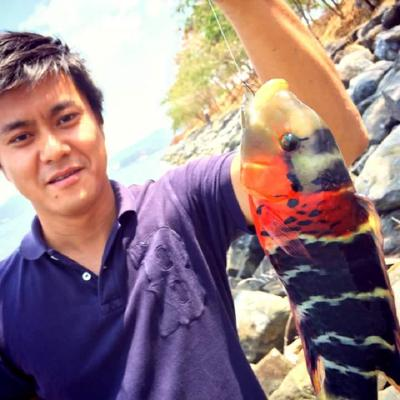

# 自己紹介

<b>田中学二 (Gakuji Tanaka)</b> 
奄美大島出身の釣り好きです。
現在、家族は大阪にいて東京で単身赴任中です。
田舎育ちなのか人前にでるのが苦手で基本的にインドア派です。
ただ、住んでいる環境が代わり減りましたがが自然も好きで釣りに行ったりします。
後、お誘い頂ければ何処にでも出没します。文章も苦手ですが、品質保証の事、テストの事、マネージメントの事や日々想う事を書いていきますので時間ある時にでも眺めて頂ければと。　　

# 活動履歴

2018/12/17 : [インスタンスゼロ株式会社を共同創業] (https://ins0.jp/)

2017/11/01 : [株式会社TSUMUGU創業] (https://tsumugu-inc.com)

2015/06/26 : [JaSST'15 関西で招待講演で登壇](http://www.jasst.jp/symposium/jasst15kansai/details.html#S5-1)

2013/08/02 : [JaSST'13 関西で事例発表で登壇](http://www.jasst.jp/symposium/jasst13kansai/details.html#S3-C2)

2012/08/02 : [JaSST'12 関西でワークショップで登壇](http://www.jasst.jp/symposium/jasst12kansai/report.html#workshop)

2010/6/12 : [WACATE2010 夏](https://wacate.jp/workshops/2010summer/gaiyo/)に参加

2009/6/13 : [WACATE2009 夏](https://wacate.jp/workshops/2009summer/gaiyo/)に参加「[最優秀賞貰った!!](https://wacate.jp/wp-content/uploads/2019/02/WACATE-Magazine-007.pdf)」

# 経歴

**[株式会社メルペイ](https://jp.merpay.com/)** 
2019年03月-present 
QA Engineering Manager 

**[インスタンスゼロ株式会社](https://jp.merpay.com/)** 
2018年12月-present 
General Manager / CO-Founder 

**[株式会社Oneteam](https://www.lmi.ne.jp/services/totalsolution/teamwork-cloud.html)** 
2018年04月-2019年02月 
Chief product Officer(CPO)/QA責任者 

**[株式会社TSUMUGU](https://jp.merpay.com/)** 
2017年11月-present 
QA Engineer / Owner 

**[バルテス株式会社](https://www.valtes-mt.co.jp/)** 
2017年04月-2018年03月 
バルテスモバイルテクノロジー株式会社 担当部長 

**[KLab株式会社](https://www.klab.com/jp/)** 
2013年11月-2017年03月 
KLab Cyscorpions.Inc 
QA senior Manager 

**[デジタル・インフォメーション・テクノロジー株式会社](https://www.ditgroup.jp/)** 
2006年12月-2013年10月 
クオリティエンジニアリングカンパニー 
ジェネラルマネージャー 

**[株式会社アルプス技研](https://www.alpsgiken.co.jp/)** 
2001年04月ー2006年11月 
QAエンジニア 

----------------------------------------------

<a class="LI-simple-link" href='https://jp.linkedin.com/in/gakuji-tanaka-083856b5?trk=profile-badge'>GAKUJI Tanaka</a>

