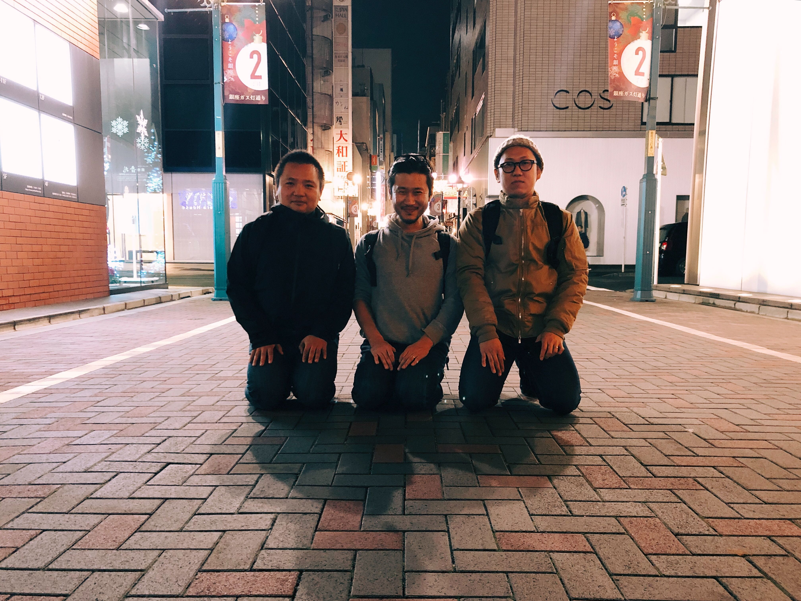
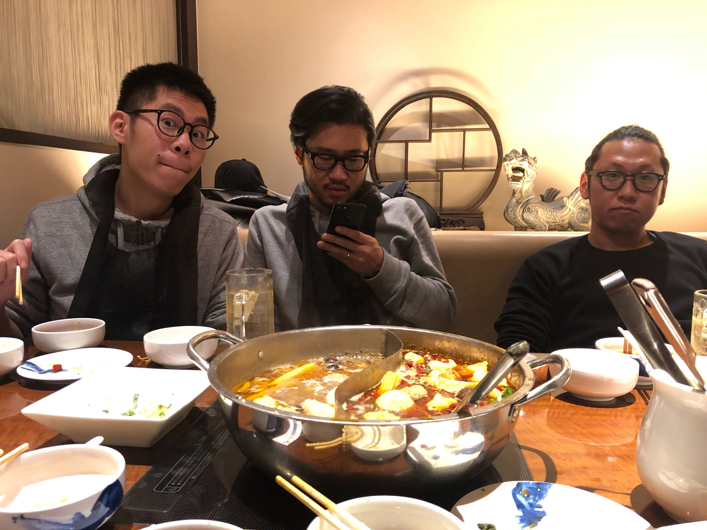
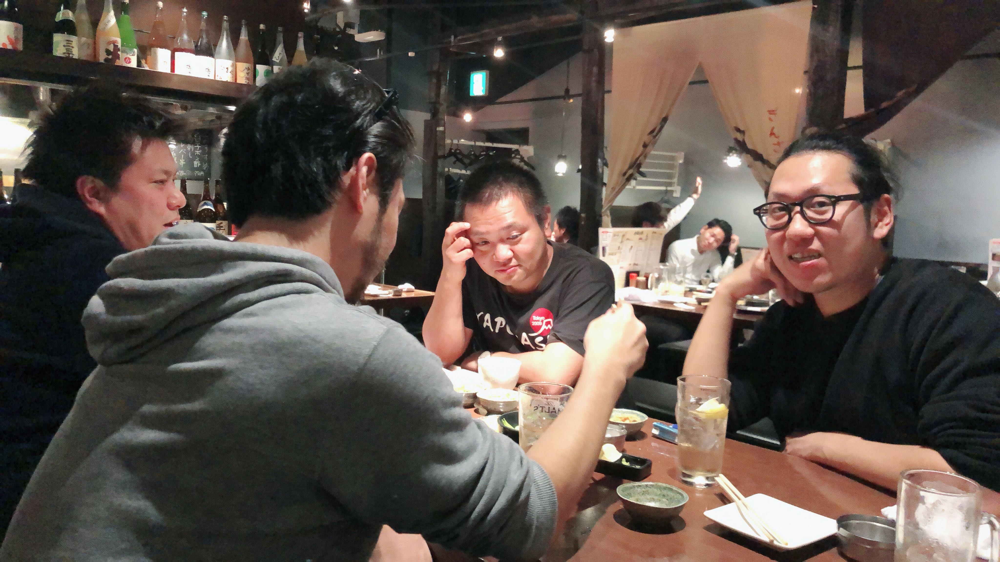

### 創業の想い
2018年12月17日にインスタンスゼロ株式会社(https://ins0.jp/)
を5人のメンバーと共同創業致しました。代表の長瀬敦史との出会いは面白く、私がゲーム会社に所属してフィリピン法人のQA立ち上げをしてた時代に、私の先輩に会いにフィリピンの <a href="https://www.takethetravel.com/calayo-cove-nasugbu-batangas-a-guide-for-backpackers/"> Calayo(カラヨ)
</a>
と言う日本人が全く居ない携帯の電波も届かないくらいの田舎に来てた時に出会いました。(一緒に釣りをしたのが始まりですね)それから、数年は連絡をとっていなかったのですが、私が日本に帰国した2017年に大阪で再会して、仕事を一緒にするようになりました。その後、長瀬を信頼するプロフェッショナルなエンジニアやデザイナーに出会う事ができ、これも何かの縁ではないかと深く感じています。今回、そのメンバーと**「WE BUILD FIRST INSTANCES」**をビジョンに、まだ見ぬソフトウェアサービスの開発ができることを嬉しく思います。これから世の中にある多くのアイディアを０→１に限りなく早くしていき社会に多くのソフトウェアサービスが生れて行く事に貢献して参ります。<a href="https://ja.ngs.io/2019/02/01/instance0/?fbclid=IwAR1mf3JBz91TjSatgbKWDPzvF-usc-xILk8qula06FykqGV1AIz_LekcRpw">詳しくは代表のブログを！
 </a>

#### 創業メンバー

<ul>
<li>ソフトウェア開発者・代表取締役社長 <a href="https://ja.ngs.io/">長瀨 敦史</a></li>
<li>システムアーキテクト <a href="https://twitter.com/osawagiboy">大澤 勇気</a></li>
<li>UI デザイナー <a href="https://carlos-liu.com/">Carlos Liu</a></li>
<li>ソフトウェア開発者 <a href="https://sugarshin.net/">佐藤 信吾</a></li>
<li>QA エンジニア・ゼネラルマネージャー <a href="https://manabu.tech/">田中 学二</a></li>
</ul>創業メンバー以外に複数のエンジニアがパートナーとして協力頂いています。

#### これからの活動
お客様の新規サービス開発に対して企画、UI/UXデザイン、仕様検討サポートから、インフラ構築、バックエンド、フロントエンド設計、開発、モバイルアプリ開発、品質保証、プロジェクトマネージメントと開発プロセス全体をサポートしていきます。また、ins0としても自社のプロダクトを企画しており、2019年度中にはMVPを出して行きます。

### これからの働き方
インスタンスゼロ株式会社は、会社や組織と言う箱に捕らわれずプロジェクトをベースに必要なメンバーが集まりサービス開発にフォーカスしたチームで活動していきます。また、ソフトウェア開発の生産性を損なうルールを無くし常に高速で変化する時代に対して対応していければと...多くのソフトウェアエンジニアがインターネット上で繋がり地域や場所を選ばず、ソフトウェアサービス開発に専念できる働き方ができればと考えております。

### 最後に
インスタンスゼロ株式会社は、いつまでも子供の心を忘れずに楽しめる、発想力豊かな大人が集まっていますので、興味ある方はご連絡下さい！釣りいきましょう。

