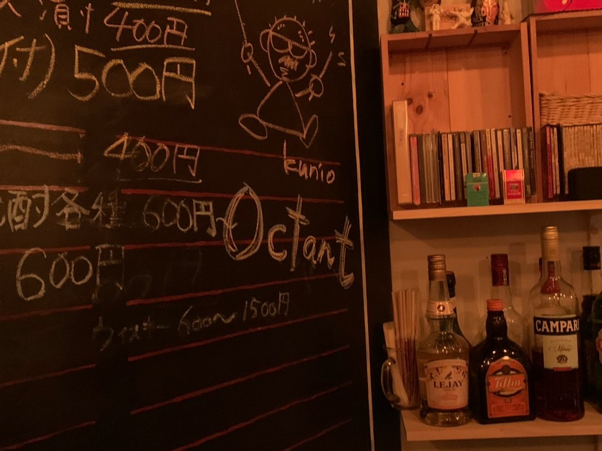

### 1期目を終えて
2019年11月末日で１期目を無事に終わる事ができ、本日決算が完了しました。
一昨年の2018年12月に会社を設立してから１年の間に１５社以上のお客様のサービス開発をさせて頂き20以上の案件に関わらせて頂きました。設立１年目の弊社を信頼して頂きシステム開発を任せて頂いた会社様には感謝しかないです。また、弊社をサポートして頂いたパートナーの皆様にもお礼申し上げます。引き続きご協力よろしくお願いします。７月に開発合宿、10月に開発拠点である不動前ラボを開設、12月にFamilyDay、忘年会、新年会等のイベントを楽しみながら、会社運用と言う初めての経験の中で、私も含めメンバーのライフワークバランスを考えながら試行錯誤の1年でした！！

### 2期目に向けて
2期目も、お客様のサービス開発のサポートを引き続き行っていますが、インスタンスゼロ株式会社の設立目的の１つである、自社サービスのローンチに向けて力を入れて行きたいです。会社の存在意義、自分達がやりたい事をもう一度考えて限られている時間をどのように使うかを決めて行ければと思います。二期目も**「WE BUILD FIRST INSTANCES」**をビジョンに、まだ見ぬソフトウェアサービスの開発を「DRINK HARD PLAY HARD & WORK SMART」でやっていきます。

